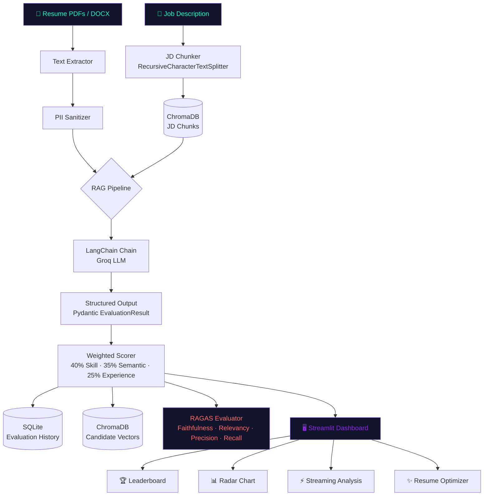

# 🤖 Yield.ai — B.A.B.Y. Evaluation Engine

<div align="center">

[](https://yield-ai.streamlit.app)
[](https://python.org)
[](https://fastapi.tiangolo.com)
[](https://langchain.com)
[](https://docker.com)
[](https://github.com/yeshshaar/baby-evaluation-engine/actions)
[](LICENSE)

**A privacy-first, production-grade AI pipeline for automated resume ranking.**
Built with LangChain · Groq · ChromaDB · RAGAS · FastAPI · Streamlit

[Live Demo](https://yield-ai.streamlit.app) · [API Docs](http://localhost:8000/docs) · [LangSmith Traces](#observability)

</div>

---

## 🧠 What is B.A.B.Y.?

**B.A.B.Y.** (Biometric & Ability Based Yield-engine) is a full-stack ML Engineering project that automates resume evaluation against Job Descriptions using a multi-stage AI pipeline.

It goes beyond simple keyword matching — combining **RAG-based JD parsing**, **structured LLM evaluation**, **semantic vector search**, and **objective RAGAS metrics** to deliver explainable, bias-reduced candidate rankings at scale.

> Built to demonstrate end-to-end ML Engineering: from data ingestion and LLM orchestration to observability, containerization, and CI/CD.

---

## 🏗️ System Architecture



---

## 🚀 Key Features

| Feature | Details |
|---|---|
| **RAG-Powered JD Parsing** | JDs are chunked (500-char, 80-char overlap) and embedded. At eval time, only the top-4 most relevant chunks per candidate are retrieved — reducing token waste and improving precision |
| **Structured LLM Evaluation** | Uses LangChain's `with_structured_output` + Pydantic to force type-safe JSON from Groq's Llama 3.1 — no fragile regex parsing |
| **Multi-Model Support** | Toggle between `llama-3.1-8b` (fast), `llama-3.3-70b` (smart), and `mixtral-8x7b` (balanced) from the UI sidebar |
| **Streaming Analysis** | FastAPI `StreamingResponse` + Groq streaming API delivers token-by-token narrative evaluation to the UI in real time |
| **RAGAS Evaluation** | Objectively measures pipeline quality with faithfulness, answer relevancy, context precision, and context recall scores |
| **Pluggable Vector DB** | Switch between ChromaDB (local), Pinecone, or Qdrant with a single `VECTOR_DB=` env var — zero code changes |
| **LangSmith Observability** | Every chain invocation is traced — latency, token usage, prompt versions, and failures visible in the LangSmith dashboard |
| **Privacy-by-Design** | PII (emails, phones, URLs) is scrubbed from every resume before any LLM call or vector storage |
| **UUID Session Isolation** | Each user session is sandboxed with a unique UUID — data cleared on session end |
| **CI/CD Pipeline** | GitHub Actions runs `ruff` lint, `mypy` type checks, `pytest` unit tests, and Docker build verification on every push |

---

## 📊 Scoring Algorithm

The Yield-AI confidence score is a weighted composite of three dimensions evaluated by Llama 3.1:

```
Yield Score = (Skill Match × 0.40) + (Semantic Match × 0.35) + (Experience Relevance × 0.25)
```

| Dimension | Weight | What it measures |
|---|---|---|
| 🎯 Skill Match | 40% | Direct overlap of technical keywords between resume and JD |
| 🧠 Semantic Match | 35% | Contextual alignment of past projects with target role requirements |
| 📈 Experience Relevance | 25% | Career progression depth and tool seniority |

---

## 🛠️ Tech Stack

| Layer | Technology |
|---|---|
| **LLM** | Groq API (Llama 3.1 8B / 70B, Mixtral 8x7B) |
| **Orchestration** | LangChain, LangChain-Groq |
| **Vector Store** | ChromaDB (default) · Pinecone · Qdrant |
| **Embeddings** | HuggingFace `all-MiniLM-L6-v2` |
| **RAG** | LangChain `RecursiveCharacterTextSplitter` + Chroma retriever |
| **Evaluation** | RAGAS (faithfulness, relevancy, precision, recall) |
| **Observability** | LangSmith tracing |
| **API** | FastAPI + Uvicorn |
| **UI** | Streamlit |
| **Database** | SQLite (history persistence) |
| **Containerization** | Docker Compose |
| **CI/CD** | GitHub Actions (ruff, mypy, pytest) |
| **Language** | Python 3.10+ |

---

## 🛡️ Privacy & Data Governance

B.A.B.Y. handles PII (Personally Identifiable Information) with a multi-layer protection model:

1. **Pre-LLM Sanitization** — emails, phone numbers, and URLs are redacted before any text reaches the LLM or vector store
2. **Session Isolation** — UUID-based sandboxing ensures no cross-session data leakage
3. **Bias Reduction** — the evaluation engine focuses on skills and experience, not personal identifiers
4. **Admin Access Layer** — historical data is protected behind a password-gated admin panel

---

## ⚡ API Endpoints

| Method | Endpoint | Description |
|---|---|---|
| `GET` | `/health` | Healthcheck (used by Docker Compose) |
| `GET` | `/models` | List available LLM models |
| `POST` | `/jd/index` | Chunk & embed a JD into the RAG store |
| `POST` | `/evaluate` | Full structured evaluation (returns JSON) |
| `POST` | `/evaluate/stream` | Streaming narrative evaluation (SSE) |
| `POST` | `/ragas/evaluate` | Run RAGAS metrics over a batch of samples |
| `POST` | `/search` | Semantic candidate search via vector similarity |

Full interactive docs at **http://localhost:8000/docs**

---

## 🔭 Observability

Every LangChain chain invocation is traced to LangSmith when `LANGCHAIN_TRACING_V2=true`:

- **Latency** per evaluation step
- **Token usage** and estimated cost
- **Prompt versions** — track drift over time
- **Failures** — pinpoint exactly where the chain broke

Set up in `.env`:
```
LANGCHAIN_TRACING_V2=true
LANGCHAIN_API_KEY=ls__your_key
LANGCHAIN_PROJECT=yield-ai
```

---

## 🐳 Installation & Setup

### Prerequisites
- Docker + Docker Compose
- Groq API key → [console.groq.com](https://console.groq.com)
- LangSmith API key (optional) → [smith.langchain.com](https://smith.langchain.com)

### 1. Clone the repo
```bash
git clone https://github.com/yeshshaar/baby-evaluation-engine.git
cd baby-evaluation-engine
```

### 2. Configure environment
```bash
cp .env.example .env
# Fill in GROQ_API_KEY, ADMIN_PASSWORD, and optionally LANGCHAIN_API_KEY
```

### 3. Run with Docker
```bash
docker-compose up --build
```

| Service | URL |
|---|---|
| Streamlit UI | http://localhost:8501 |
| FastAPI Docs | http://localhost:8000/docs |

### 4. Run locally (without Docker)
```bash
python -m venv env && source env/bin/activate
pip install -r requirements.txt
streamlit run app/dashboard.py
```

---

## 🧪 Testing

```bash
# Run all unit tests with coverage
pytest tests/ -v --cov=src --cov-report=term-missing

# Lint
ruff check src/ app/ api.py

# Type check
mypy src/ --ignore-missing-imports
```

Tests cover: PII sanitization, weighted scoring math, vector store distance conversion, and chain fallback behavior.

---

## 📁 Project Structure

```
baby-evaluation-engine/
├── app/
│   └── dashboard.py          # Streamlit UI
├── src/
│   ├── chains.py             # LangChain evaluation chains + streaming
│   ├── jd_rag.py             # RAG pipeline for JD chunking & retrieval
│   ├── ragas_evaluator.py    # RAGAS pipeline quality metrics
│   ├── vector_store.py       # Pluggable vector DB (Chroma/Pinecone/Qdrant)
│   ├── database.py           # SQLite persistence
│   ├── extractor.py          # PDF/DOCX text extraction
│   ├── sanitizer.py          # PII scrubbing
│   ├── optimizer.py          # AI resume bullet point generator
│   └── visualizer.py         # Plotly radar charts
├── tests/
│   └── test_pipeline.py      # Unit tests
├── .github/
│   └── workflows/ci.yml      # GitHub Actions CI/CD
├── api.py                    # FastAPI application
├── docker-compose.yml
├── Dockerfile.api
├── Dockerfile.ui
├── requirements.txt
└── .env.example
```

---

## 🗺️ Roadmap

- [ ] Prompt versioning with YAML-based prompt management
- [ ] Token usage + cost tracking dashboard
- [ ] Multi-tenant support with user accounts
- [ ] Batch evaluation via CSV upload
- [ ] Export evaluation report as PDF

---

## 👨‍💻 Author

**Yeshwin Shaaradha**
[](https://linkedin.com/in/yeshshaar)
[](https://github.com/yeshshaar)

---

<div align="center">
<sub>Built with 🤖 LangChain · ⚡ Groq · 🔍 ChromaDB · 📊 RAGAS · 🚀 FastAPI</sub>
</div>
